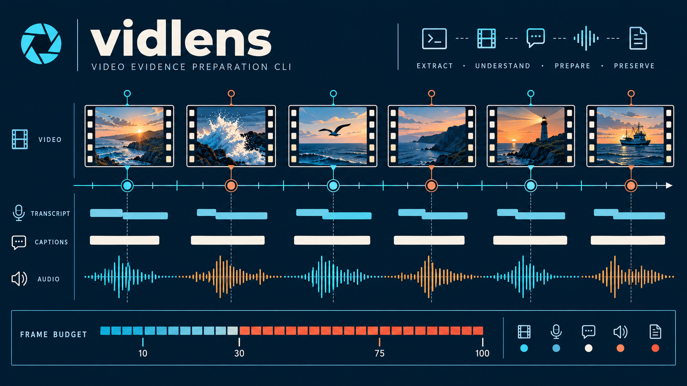

<div align="center">



# vidlens · 视频透镜

**让 AI Agent 看懂整段视频：说了什么、画面出现什么，以及分别发生在何时。**

抖音与 B 站 → 原视频、音频、带时间戳转写、自适应帧图和统一证据时间线

[快速开始](#快速开始) · [安装](#安装) · [输出内容](#输出内容) · [平台支持](#平台支持)

[](https://github.com/lordfine/vidlens/actions/workflows/ci.yml)
[](pyproject.toml)
[](LICENSE)
[](#平台支持)

</div>

## 让 Agent 读视频，不只是听视频

vidlens 为调用它的 Agent 准备可引用的多模态证据。工具不生成摘要、不连接多模态 API，也不会把媒体上传到 vidlens 服务；结论由 Agent 使用自己的多模态能力完成。

| 证据 | vidlens 提供什么 |
|---|---|
| 原视频 | 缓存中的本地文件路径，Agent 可查看画面与画面文字 |
| 原音频 | 即使视频已有平台字幕，也始终缓存并在 manifest 中提供路径 |
| 语音与字幕 | 优先保留平台字幕；无字幕时使用本地 ASR，片段带起止时间 |
| 帧图 | 在整段视频范围内自适应取样；按需可对时间区间补帧 |
| 证据时间线 | 按视频时间排序，关联字幕/语音片段与帧图文件 |

## 快速开始

```bash
vidlens prepare "https://v.douyin.com/xxxx/" --granularity medium
```

也支持 B 站：

```bash
vidlens prepare "https://www.bilibili.com/video/BVxxxxxx/" --granularity medium
```

先读输出目录中的 `context.md` 和 `manifest.json`。Agent 可按 `manifest.files.evidence_timeline` 读取统一时间线，并从 `manifest.files.video_local`、`manifest.files.audio_local` 访问缓存媒体。媒体路径在用户清理对应缓存前有效；素材包默认不复制大文件。

### 自适应帧预算

帧预算按画面变化自适应，不按固定帧率把长视频前段抽满：

- 至少 10 帧作为全片覆盖基础，默认以 30 帧为基准，画面稳定时可降至 10 帧；常规上限 75 帧。
- 画面变化明显时可自动扩到 100 帧；超过 100 帧必须先得到用户明确允许，并显式传入 `--allow-over-100-frames`。
- manifest 记录实际帧数、时间戳、图像尺寸和选帧原因。具体图片 token 数由调用模型决定。
- 需要看局部细节时，Agent 可在用户已提供的视频上按时间段补帧：

```bash
vidlens frames "https://v.douyin.com/xxxx/" --mode count --start 120 --end 150 --count 10
```

`--start` 和 `--end` 使用视频秒数，补帧时间戳仍对应原视频时间。

## 安装

### 全局安装

使用 [uv](https://docs.astral.sh/uv/) 将 `vidlens` 安装为全局命令：

```bash
uv tool install --python 3.11 git+https://github.com/lordfine/vidlens.git
vidlens doctor
```

升级到 GitHub 上的最新版本：

```bash
uv tool upgrade vidlens
```

首次本地语音识别需下载约 160 MB；解压后的 SenseVoice 模型缓存占用约 230 MB。之后会复用本机缓存。

### 开发安装

```bash
git clone https://github.com/lordfine/vidlens.git
cd vidlens
uv sync --group dev
uv run vidlens doctor
```

## 输出内容

```text
素材包/
├── manifest.json              # 机器可读清单、缓存媒体路径与帧预算
├── evidence-timeline.json     # 按视频时间排序的字幕/语音与帧图索引
├── context.md                 # 给 Agent 的素材导读和时间轴使用说明
├── subtitle.srt / .json       # 平台字幕；无字幕时为 transcript.*
├── frames/                    # 自适应抽样的帧图，带原视频时间戳
└── contact_sheet.jpg          # 便于快速浏览的总览图（部分颗粒度）
```

兼容的旧 manifest 字段继续保留；新时间线、音频路径和预算信息以新增字段提供。

## 命令

| 命令 | 用途 |
|---|---|
| `vidlens meta URL` | 获取元信息与可用字幕轨，不下载视频 |
| `vidlens subs URL` | 获取平台字幕；无字幕时本地 ASR 兜底 |
| `vidlens transcribe URL` | 本地 ASR，生成带时间戳的转写 |
| `vidlens frames URL --mode adaptive` | 全片自适应取帧 |
| `vidlens frames URL --mode count --start 120 --end 150 --count 10` | 对指定时间段补帧 |
| `vidlens prepare URL --granularity coarse\|medium\|fine` | 生成多模态证据素材包 |
| `vidlens cache list\|clean\|stats` | 查看、清理缓存和占用空间 |
| `vidlens doctor` | 检查 ffmpeg、ASR 运行时和网络 |

常用通用参数：`--cookie`、`--cookie-file`、`--fresh`、`--out`。

## 平台支持

| 运行平台 | 支持范围 | 备注 |
|---|---|---|
| Windows x86_64 | 完整工作流 | SenseVoice 使用 `sherpa-onnx` wheel 自带运行时 |
| Linux x86_64 | 完整工作流 | 缓存遵循 `XDG_DATA_HOME` |
| macOS Intel | 完整工作流，最低 macOS 10.15 | 依赖 wheel 支持范围 |
| macOS Apple Silicon | 完整工作流，最低 macOS 11.0 | 依赖 wheel 支持范围 |

抖音与 B 站都支持以上运行平台。B 站登录态可通过 `--cookie` 或 `--cookie-file` 提供，以访问高清媒体与字幕；vidlens 不会读取浏览器登录状态。

CI 在 Windows/Linux 上运行 Python 3.11 与 3.14 检查；macOS Intel 与 Apple Silicon 检查目前为非阻断项，用于持续发现兼容问题。

## Agent 契约与故障排查

- stdout 输出 JSON，错误写入 stderr；错误对象包含可执行的 `hint`。
- 媒体缓存共享，ASR 转写缓存共享；每次调用的产物目录彼此独立。
- 模型首次下载会串行化，避免并发任务写坏模型文件。
- Windows 首次本地转写若出现 `python.exe - 应用程序错误`，请从[微软官方页面](https://learn.microsoft.com/en-us/cpp/windows/latest-supported-vc-redist?view=msvc-170)安装或修复最新版 Visual C++ v14 x64 运行库，再重试原命令；不要删除或覆盖 `System32` 中的 DLL。
- 抖音风控时可提供 `--cookie`；不要把 cookie 提交到 issue 或公开日志。

## 开发与校验

```bash
uv run ruff check src tests
uv run pytest -q
```

真实平台链路需要显式启用 `VIDLENS_E2E=1`。本地 ASR 模型只在首次转写时下载。

## 致谢

[yt-dlp](https://github.com/yt-dlp/yt-dlp) · [sherpa-onnx](https://github.com/k2-fsa/sherpa-onnx) · [SenseVoice](https://github.com/FunAudioLLM/SenseVoice) · [faster-whisper](https://github.com/SYSTRAN/faster-whisper) · [imageio-ffmpeg](https://github.com/imageio/imageio-ffmpeg)

## 许可

[MIT](LICENSE)
